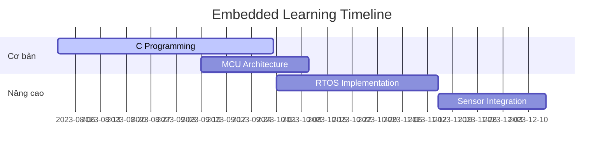

# Lộ trình phát triển kỹ năng Embedded Systems

## Milestone 1: Nền tảng (3 tháng)
- Thành thạo Embedded C
- Hiểu ARM Cortex-M architecture
- Lập trình GPIO/UART cơ bản

## Milestone 2: Hệ thống (6 tháng)
- FreeRTOS integration
- Driver development
- Power management

## Milestone 3: Ứng dụng (9 tháng)
- IoT protocols (MQTT, CoAP)
- BLE/Wi-Fi stack
- Security fundamentals

## Timeline
